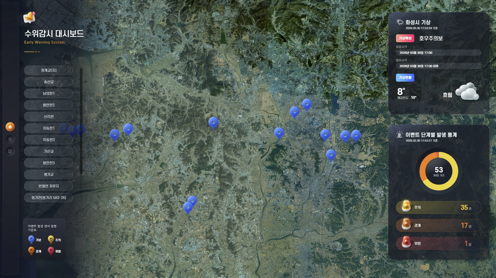

# 화성시 수위감시 대시보드 (EAS)

> **한 줄 소개**  
> 화성시 하천·저류지에 설치된 **IoT 수위 센서를 실시간으로 모니터링**하는 조기경보 시스템. 수위가 위험 단계에 도달하면 지도에서 즉시 확인하고, 기상특보와 함께 보고 판단할 수 있는 관리자용 대시보드입니다.

---

## 🎯 무엇을 위한 시스템인가요?

집중호우 등으로 **하천이 범람하기 전에 미리 감지하고 대응**하기 위해 만든 시스템입니다.  
시 곳곳에 설치된 수위 센서가 보내는 실시간 데이터를 지도 위에 색상으로 표시하고, 기상청의 호우주의보·홍수경보 같은 특보와 함께 보여줘서 담당자가 **재난 발생 여부를 빠르게 판단**할 수 있게 해줍니다.

---

## 🖥️ 화면 구성

상단 네비게이션으로 **3개의 화면**을 전환하며 사용합니다.

- **메인 화면**: 화성시 위성지도 위 수위 센서 위치 + 단계별 색상 마커 + 기상 정보
- **이벤트 화면**: 발생한 경보 이벤트 목록 + 위치 지도 + CCTV 영상
- **통계 화면**: 선택한 센서의 시간별 수위 측정 차트

---

## 🛠️ 주요 기능

### 1. 메인 화면 — 수위 센서 지도 + 기상 정보



- **Leaflet 위성지도 기반 수위 센서 위치 실시간 시각화**  
  단계별 색상 마커로 수위 정도를 한눈에 표시 (기본 → 주의 → 경계 → 위험)
- **기상청 특보 API 연동**  
  호우주의보·홍수경보 등 현재 발령 중인 특보 현황 표시

---

### 2. 이벤트 화면 — 발생 내역 & CCTV

- **월별·일별·시간별 이벤트 발생 내역 테이블**  
  언제 어디서 어떤 경보가 발생했는지 시계열로 확인
- **CCTV 표출을 통한 실시간 하천 모니터링**  
  이벤트 발생 위치 근처 CCTV로 현장 상황 즉시 확인

---

### 3. 통계 화면 — 수위 측정 차트

- **시간별 수위 측정 차트** (Highcharts)  
  선택한 센서의 수위 변화 추이 시각화
- **엑셀 다운로드** — 측정 데이터를 파일로 내려받기

---

## 🧱 사용한 기술

| 영역 | 기술 |
|---|---|
| 백엔드 언어/프레임워크 | Java 1.8, Spring Boot 2.7.1 |
| 백엔드 라이브러리 | Spring Data JPA / JDBC, **Spring WebSocket**, **Netty**(외부 IoT 소켓 통신), **Quartz**(스케줄러), Apache POI(엑셀), Thymeleaf |
| 데이터베이스 | PostgreSQL (다중 DB 구성: sensor / eas / sms) |
| 프론트 언어/프레임워크 | React 18, TypeScript |
| 상태관리 | Redux Toolkit + Redux Saga |
| 지도(GIS) | Leaflet.js (+ leaflet-draw, leaflet-geometryutil) |
| 차트 | Highcharts 11 |
| 빌드 | Maven (백엔드), npm (프론트) |

---

## 📂 전체 폴더 구조

```
easapi/
├── src/main/java/com/eseict/eas/      # 백엔드 (Spring Boot)
│   ├── controller/    ⭐ API 입구 — 어떤 주소로 어떤 데이터를 받는지
│   │   ├── sensor/    — 수위 센서 정보 API
│   │   ├── event/     — 경보 이벤트 API
│   │   ├── api/       — 기상청(공공데이터) API 프록시
│   │   ├── cctv/      — CCTV 정보 API
│   │   ├── iot/       — IoT 디바이스·통계·원시데이터 API
│   │   ├── member/    — 사용자/조직 API
│   │   └── history/   — 재난 이력 API
│   ├── service/       ⭐ 실제 로직 — 데이터 가공·외부 API 호출·스케줄러
│   │   ├── api/       — 기상 API 매시간 호출 (Quartz)
│   │   ├── sensor/    — 수위 센서 로직
│   │   ├── event/     — 이벤트 로직
│   │   ├── iot/       — IoT 디바이스 로직
│   │   ├── history/   — 이력 로직
│   │   └── member/    — 사용자 로직
│   ├── dao/           — DB 접근 (JDBC 기반)
│   ├── repository/    — JPA Repository (event, history)
│   ├── domain/        — JPA 엔티티 (oms, sms, dst, dw, ioc)
│   ├── dto/           — 화면에 내려보낼 데이터 형식 정의
│   ├── socket/        ⭐ Netty 기반 외부 IoT 소켓 서버 (rinoEvent)
│   ├── config/        — DB·WebSocket·앱 설정
│   │   ├── db/        — 다중 DB 설정 (Sensor / Eas / Sms)
│   │   └── websocket/ — WebSocket 설정
│   └── util/          — 공통 유틸 (HTTP, 문자열, ID 생성 등)
│
├── dashboard/                          # 프론트엔드 (React + TypeScript)
│   └── src/
│       ├── config/    — 환경 설정·인터페이스 정의·상수
│       ├── public/    — 정적 리소스 (CSS, 이미지)
│       └── pages/
│           ├── components/  ⭐ 화면 UI 컴포넌트
│           │   ├── main/    — 메인 화면 (지도 + 기상)
│           │   ├── event/   — 이벤트 화면 (목록 + CCTV)
│           │   └── stat/    — 통계 차트 화면
│           ├── saga/        ⭐ 서버 API 호출 + WebSocket 처리
│           │   ├── main/    — 메인 화면 사가
│           │   ├── event/   — 이벤트 사가
│           │   ├── stat/    — 통계 사가
│           │   └── ws/      — WebSocket 사가 (실시간 이벤트 수신)
│           └── store/       — Redux 상태 저장소
│               ├── server/  — 서버에서 받은 데이터 보관
│               └── view/    — 화면 상태(선택한 센서, 탭 등)
│
├── pom.xml                — 백엔드 의존성 목록 (Maven)
├── package.json           — 프론트 의존성 목록 (npm)
├── mvnw, mvnw.cmd         — Maven 실행 스크립트
└── README.md              — 이 문서
```

> ⭐ 표시: 코드를 처음 볼 때 가장 먼저 열어보면 좋은 곳

---

## 🗺️ 기능 → 코드 위치 매핑

**파일/폴더명을 클릭하면 GitHub에서 바로 해당 위치로 이동합니다.**

### 백엔드 (서버) — 외부 데이터를 받아서 화면에 내려주는 쪽

| 기능 | 어떤 역할을 하는지 | 핵심 파일 |
|---|---|---|
| 수위 센서 조회 | 화성시에 설치된 모든 수위 센서의 위치·상태·현재 수위값을 한 번에 내려줌 | [SensorController.java](src/main/java/com/eseict/eas/controller/sensor/SensorController.java) |
| 경보 이벤트 조회 | 발생한 경보(주의·위험)를 시간순으로 정리해서 내려줌 | [EventController.java](src/main/java/com/eseict/eas/controller/event/EventController.java) |
| **기상 정보 연동** | 기상청 공공데이터 API에서 받은 화성시 예보와 특보(호우주의보·홍수경보 등)를 화면에 맞게 가공해서 내려줌 | [WeatherController.java](src/main/java/com/eseict/eas/controller/api/WeatherController.java) |
| **기상 정보 매시간 자동 수집** | Quartz 스케줄러가 1시간마다 기상청 API를 호출해 DB에 자동 저장 | [service/api/WeatherService.java](src/main/java/com/eseict/eas/service/api/WeatherService.java) |
| CCTV 정보 조회 | 등록된 CCTV의 위치와 영상 스트림 주소를 내려줌 | [CctvController.java](src/main/java/com/eseict/eas/controller/cctv/CctvController.java) |
| IoT 수위계 데이터 조회 | 외부 IoT 플랫폼에 등록된 수위계 디바이스 정보·통계·원시 측정값을 가져옴 | [IotController.java](src/main/java/com/eseict/eas/controller/iot/IotController.java) |
| **엑셀 다운로드** | 측정 데이터를 Apache POI로 엑셀 파일로 변환해서 내려줌 | [IotController.java](src/main/java/com/eseict/eas/controller/iot/IotController.java) |
| 사용자·조직 정보 | 시스템 사용자, 조직, 알림 대상자 정보 조회 | [MemberController.java](src/main/java/com/eseict/eas/controller/member/MemberController.java) |
| 재난 이력 관리 | 과거에 발생했던 재난 정보 조회·수정 | [historyController.java](src/main/java/com/eseict/eas/controller/history/historyController.java) |
| **외부 IoT 소켓 서버 (Netty)** | 수위계 업체 시스템과 TCP 소켓으로 직접 연결해 실시간 측정 데이터를 받아오는 핵심 모듈 | [RinoEventSocketServer.java](src/main/java/com/eseict/eas/socket/rinoEvent/rcv/RinoEventSocketServer.java) · [RinoEventSocketHandler.java](src/main/java/com/eseict/eas/socket/rinoEvent/rcv/RinoEventSocketHandler.java) |
| **실시간 이벤트 push (WebSocket)** | 새 경보가 발생하면 사용자 브라우저로 즉시 알림을 보냄 | [config/websocket/](src/main/java/com/eseict/eas/config/websocket) |
| **다중 DB 연결 설정** | 수위 센서 DB / 시스템 DB / 문자(SMS) DB 세 개를 동시에 연결해서 사용 | [config/db/](src/main/java/com/eseict/eas/config/db) |

### 프론트엔드 (화면) — 사용자가 보는 쪽

| 화면/기능 | 어떤 역할을 하는지 | 핵심 폴더·파일 |
|---|---|---|
| **앱 시작점** | React 앱이 처음 실행되는 진입 파일, CSS 로드와 Store 설정 | [dashboard/src/index.tsx](dashboard/src/index.tsx) |
| **전체 라우팅** | 상단 네비게이션 선택에 따라 메인/이벤트/통계 3개 화면을 분기, 진입 시 필요한 초기 데이터 호출 | [components/root.tsx](dashboard/src/pages/components/root.tsx) |
| 상단 네비게이션 | 화면 전환 메뉴 | [main/nav.tsx](dashboard/src/pages/components/main/nav.tsx) |
| **메인 화면** | 위성지도 + 센서 마커 + 기상 정보를 한 화면에 보여주는 메인 대시보드 | [main/mainRoot.tsx](dashboard/src/pages/components/main/mainRoot.tsx) |
| └ 지도 (Leaflet 위성지도) | Leaflet으로 화성시 위성지도 렌더링 | [main/mainArea/gis/](dashboard/src/pages/components/main/mainArea/gis) |
| └ **단계별 색상 마커** | 수위 단계(기본·주의·경계·위험)에 따라 마커 색상을 다르게 표시 | [main/mainArea/gis/mainMarker.tsx](dashboard/src/pages/components/main/mainArea/gis/mainMarker.tsx) |
| └ 단계별 발생 통계 | 단계별 센서 개수(주의 OO건 / 경계 OO건 / 위험 OO건) 도넛 차트 | [main/mainArea/stat/](dashboard/src/pages/components/main/mainArea/stat) |
| └ **기상 정보 박스** | 현재 발령 중인 특보와 예보를 화면 한쪽에 고정 표시 | [main/mainArea/weather/](dashboard/src/pages/components/main/mainArea/weather) |
| └ 센서 목록 | 좌측에 전체 센서 리스트 표시, 클릭하면 상세로 이동 | [main/list/](dashboard/src/pages/components/main/list) |
| └ 센서 상세 패널 | 특정 센서 선택 시 해당 센서의 상세 정보·이력 표출 | [main/detailArea/](dashboard/src/pages/components/main/detailArea) |
| **이벤트 화면** | 발생한 경보 이벤트와 CCTV 영상을 함께 보는 화면 | [event/eventRoot.tsx](dashboard/src/pages/components/event/eventRoot.tsx) |
| └ 이벤트 지도 | 발생 위치를 지도에 표시 | [event/gis/](dashboard/src/pages/components/event/gis) |
| └ 이벤트 목록 | 월별/일별/시간별로 발생 이벤트를 테이블로 표시 | [event/list/](dashboard/src/pages/components/event/list) |
| └ **CCTV 플레이어** | 선택한 위치의 CCTV 실시간 영상 재생 | [event/eventPlayer.tsx](dashboard/src/pages/components/event/eventPlayer.tsx) · [event/box/player/](dashboard/src/pages/components/event/box/player) |
| └ 시간대별 발생 통계 | 시간대별 이벤트 발생 빈도 차트 | [event/box/timeStat/](dashboard/src/pages/components/event/box/timeStat) |
| **통계 화면** | 선택한 센서의 수위 변화 추이 분석 화면 | [stat/statRoot.tsx](dashboard/src/pages/components/stat/statRoot.tsx) |
| └ **시간별 수위 차트** | Highcharts로 시간 흐름에 따른 수위 측정값 그래프 | [stat/graph/graphTimeChart.tsx](dashboard/src/pages/components/stat/graph/graphTimeChart.tsx) |
| **서버 API 호출 (Saga)** | 백엔드 API를 호출하고 결과를 Redux에 저장하는 비동기 처리 로직 | [pages/saga/](dashboard/src/pages/saga) |
| **실시간 WebSocket 처리** | 서버에서 push 되는 새 경보를 받아 화면에 즉시 반영 | [pages/saga/ws/wsSaga.ts](dashboard/src/pages/saga/ws/wsSaga.ts) |
| **상태 저장소 (Redux Store)** | 서버 응답 데이터와 화면 상태(선택 센서, 탭 등)를 보관 | [pages/store/](dashboard/src/pages/store) |

---

## 🔍 처음 코드를 보는 분께 — 추천 탐색 순서

1. **[dashboard/src/index.tsx](dashboard/src/index.tsx)** — 앱 시작점, 어떤 CSS와 컴포넌트가 로드되는지
2. **[components/root.tsx](dashboard/src/pages/components/root.tsx)** — 3개 화면(Main/Event/Stat) 분기와 초기 데이터 로드
3. **[main/mainRoot.tsx](dashboard/src/pages/components/main/mainRoot.tsx)** — 메인 화면이 어떻게 구성되는지
4. **[SensorController.java](src/main/java/com/eseict/eas/controller/sensor/SensorController.java)** — 화면이 부르는 수위 센서 API
5. **[RinoEventSocketServer.java](src/main/java/com/eseict/eas/socket/rinoEvent/rcv/RinoEventSocketServer.java)** — Netty 기반 외부 IoT 시스템 연동의 핵심
6. 관심 있는 기능이 보이면, 위의 **"기능 → 코드 위치 매핑"** 표에서 해당 폴더로 이동
